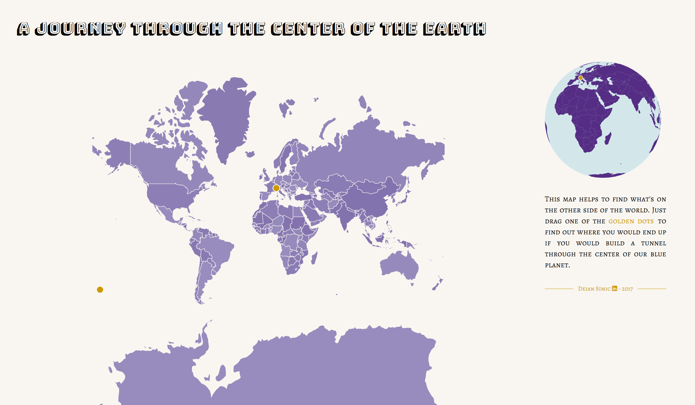

# A Journey Through the Center of the Earth

[This map](https://simicd.github.io/journey-through-center-of-earth/) helps to find what's on the other side of the world. By picking and dragging one of the two selectors it allows to see where one would end up if there was a tunnel going through the center of the planet. 

The map and globe were created with the great [d3.js](https://d3js.org/) library.

In order to find the point on the other side of the world, 
a simple calculation based on the selected longitude and latitude needs to be performed:
- Longitude: Take the absolute of the number that results after deducting 180° and switch from W to E or vice versa.
In decimal numbers this is equivalent to deducting 180° if selected point is larger than 0° or otherwise adding 180°
- Latitude: Switch the hemisphere from N to S or vice versa which is equivalent to changing sign if coordinates are in decimal format

> ### Example: Coordinates of Zurich
> The longitude of Zurich is `8.541698°`. Therefore to get to the other side, deduct 180° which results in `-171.458302°`
>
> The latitude of Zurich is `47.367664°`. Hence the latitude of the point on the other side of the world is `-47.367664°`
> 
> In degrees, minutes and seconds the position of Zurich is `[E 8° 32' 30.1143", N 47° 22' 3.5911"]` 
> and `[W 171° 27' 29.8857", S 47° 22' 3.5911"]` is on the other side of the world.

